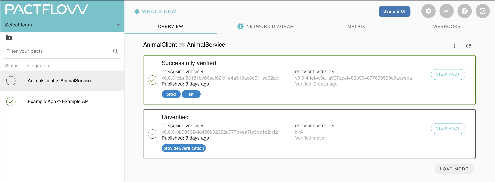

# PactSwift Provider on Linux

An example project demonstrating the minimal setup required to use `PactSwift` to verify a provider.

Verifies the `AnimalClient-AnimalService.json` contract fetched from [Pactflow.io](https://pactflow.io) pact broker and submits the verification results:



## Running it yourself

1. Provider project is built using [Vapor 4](https://vapor.codes).

2. Requires PostgreSQL (using Docker in this project) with two databases.

```sh
# for running
docker run --name postgres -e POSTGRES_DB=vapor \
  -e POSTGRES_USER=vapor -e POSTGRES_PASSWORD=password \
  -p 5432:5432 -d postgres

# for testing
docker run --name postgres-test -e POSTGRES_DB=vapor-test \
  -e POSTGRES_USER=vapor -e POSTGRES_PASSWORD=password \
  -p 5443:5432 -d postgres
```

3. Change the `pactBroker` configuration in [`PactTests.swift`](Tests/AppTests/PactTests.swift) to either your Pact Broker configuration, your folder(s) containing pacts or pact files/URLs.


## Note

This project does **not** demonstrate best coding practices or good code architecture!
